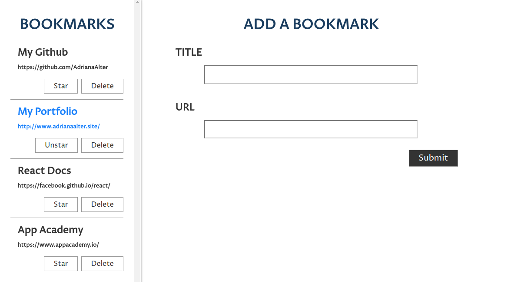

#<a href="https://adrianaalter.github.io/Bookmark-UI/">Bookmark UI</a>

This is a user interface for adding and viewing bookmarks (consisting of a title and a url); bookmarks can be created, starred and unstarred, and deleted.  The app is built with React components and Flux architecture.  It uses the HTML5 viewport element for full responsiveness.  Other features include error and success messages.  

<a href="https://adrianaalter.github.io/Bookmark-UI/"></img></a>
